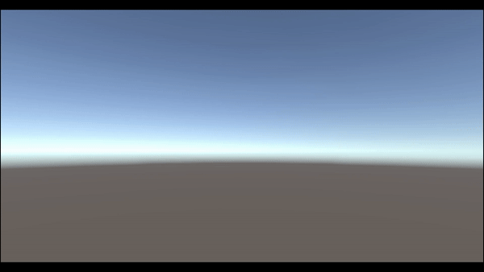

# Newton's Cradle Simulation 🎢

This project is a physics simulation that recreates the behavior of Newton's Cradle without using Unity's built-in Rigidbody, Collider, or Transform components. Instead, all physical interactions, including collisions and motion dynamics, were implemented from scratch in native code.

## 🛠️ About the Project

Newton's Cradle is a classic physics demonstration that shows conservation of momentum and energy. In this project, I recreated the movement of the pendulums by developing custom classes to handle physical properties, focusing on the dynamics of the pendulum and the collision interactions between the spheres.

## 🎯 Features

- **Custom Physics Implementation**: 
  - Built from scratch to simulate pendulum motion, collision detection, and energy transfer.
- **Dynamic Collision Handling**: 
  - Custom collision detection system to manage interactions between pendulums.
- **Physics Principles Applied**:
  - Conservation of momentum and energy, Newton's laws of motion applied through custom logic.

## 🚀 What I Learned

- **Fundamental Physics**: 
  - Deepened understanding of Newton's laws and how they can be translated into a physics simulation.
- **Custom Physics System**: 
  - Gained experience in developing physics behaviors without relying on Unity’s built-in components.
- **Problem-Solving**: 
  - Tackled challenges related to collision resolution, momentum transfer, and energy conservation.


## 🔧 Built With

- **Engine**: Unity (custom components for physics)
- **Language**: C#

## 📷 Screenshots




## 📂 How to Run

1. Clone the repository:
   ```bash
   git clone https://github.com/Hessine-Lengliz/NewtonsCradle.git
   Open the project in Unity (version XX.X.X or later).
Press the Play button to start the simulation.
📢 Feedback
Experience the intricacies of physics in this custom simulation! If you have any feedback, feel free to open an issue or reach out via:

Email: [Your Email]
GitHub Profile: [Your GitHub Profile]
🛠️ Languages and Tools
<p align="left"> <a href="https://unity.com/" target="_blank" rel="noreferrer">  </a> <a href="https://www.cprogramming.com/" target="_blank" rel="noreferrer">  </a> <a href="https://git-scm.com/" target="_blank" rel="noreferrer">  </a> </p> ```
